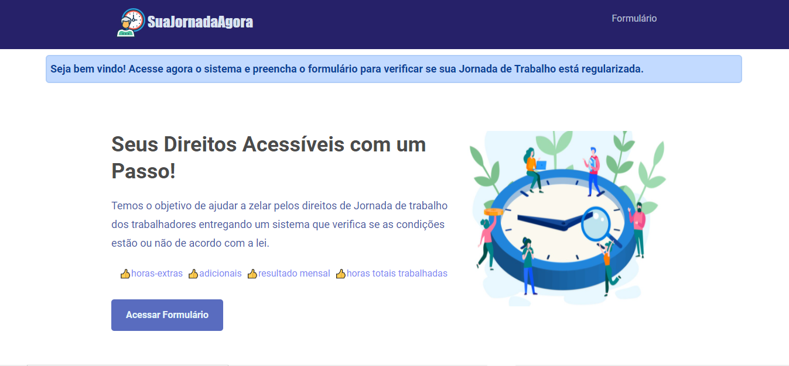
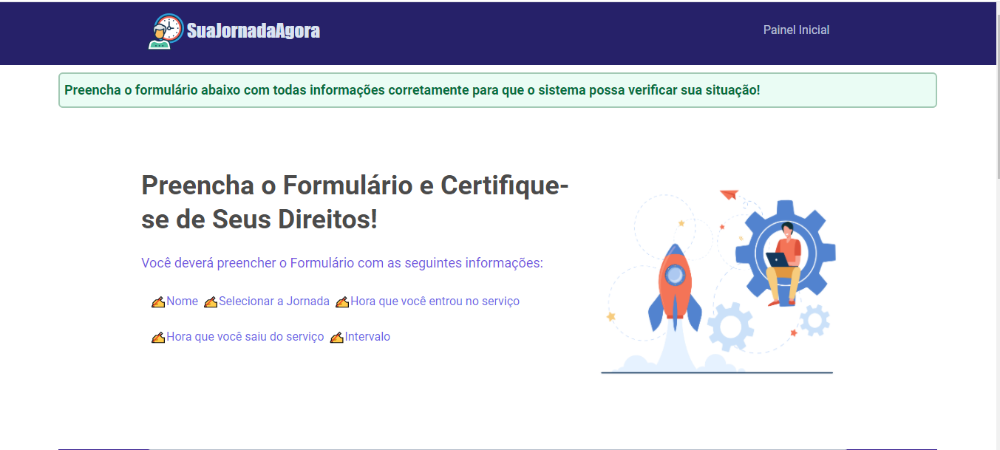
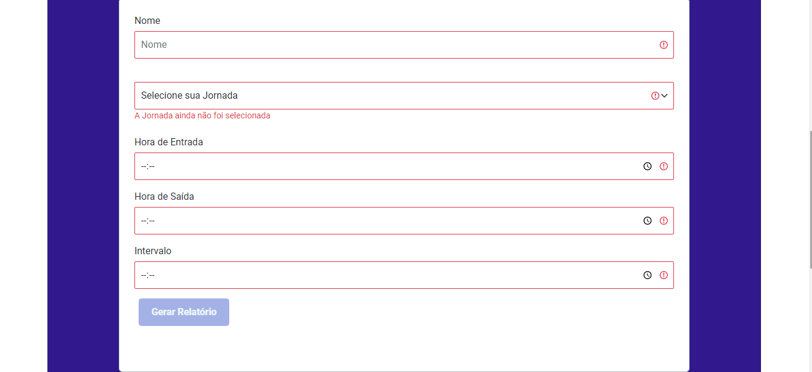

# SuaJornadaAgora 

# Projeto do Desafio da Empresa - Ahgora

## Sobre

 Trata de um projeto voltado para alertar os trabalhadores sobre suas jornadas de trabalho, em que cada usuário terá a possibilidade de selecionar sua jornada, entre as 3 jornadas existentes no sistema (5X1, 5X2, 6X1).

 O sistema possui um formulário em que o usuário deverá preencher hora de entrada, saída e intervalo se possuir.   Após o usuário preecher as informações o sistema irá calcular e gerar a horas diárias trabalhadas, bem como as horas semanalmente, mensalmente e anualmente, e irá verificar se está de acordo com a lei com base na jornada selecionada. 

  

## Features

- [x] Conteúdo acessível e atualizado
- [x] Sistema de validação de hora noturna, diurna, matutina
- [x] Formulário com sistema inteligente, validação de dados
- [x] Relatório com validação por cor, Verde regular, Vermelho Irregular

  

## Tecnologias

- [HTML](https://html.spec.whatwg.org/)
- [CSS-Bootsrap](https://getbootstrap.com/docs/4.5/components/alerts/)
- [CSS](https://developer.mozilla.org/pt-BR/docs/Web/CSS)
- [Javascript](https://developer.mozilla.org/pt-BR/docs/Web/javascript)

  

## Imagens

### Primeiro acesso do Site

  

### Artigos em Modal

  

### Acessando Formulário

  

### Formulário

  

## Desenvolvedor do Projeto

<strong> Raphael Angel Palhano </strong>

 Sou estudante e amante de tecnologia e apaixanado em de alguma maneiras as pessoas.  

